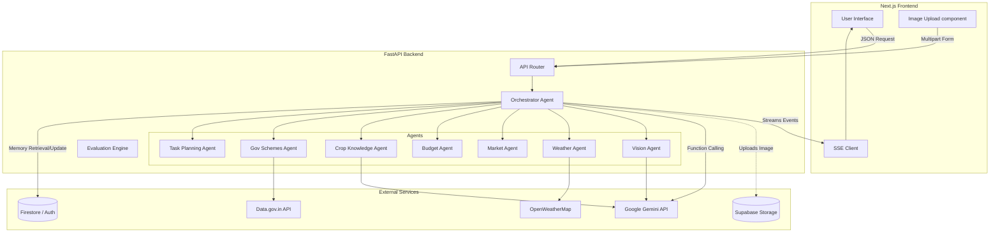
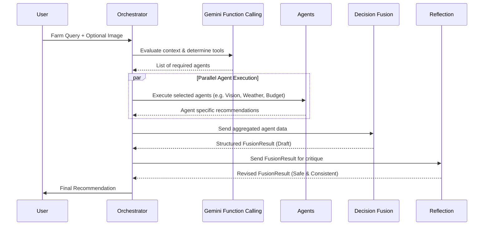
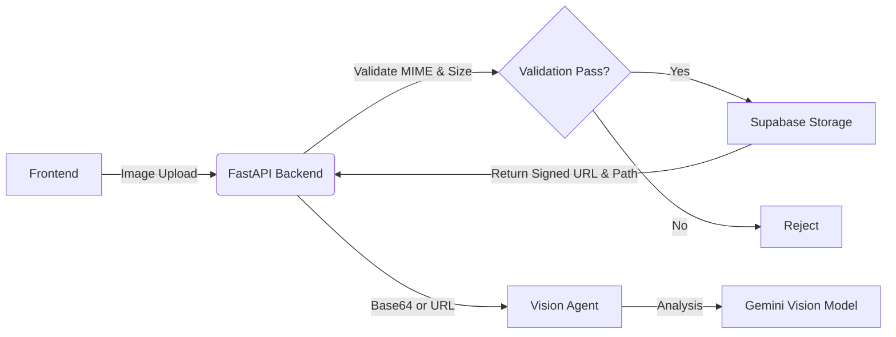

# SEED AI Architecture

This document contains Mermaid diagrams illustrating the core architectural flows of SEED AI.

## 1. Overall System Architecture

## 2. Decision Fusion Workflow

## 3. Storage Flow

